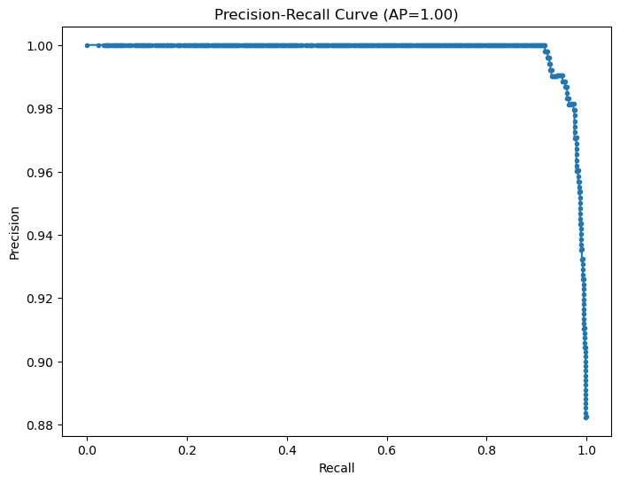

# Autism Spectrum Disorder (ASD) Screening Classification

  
*Visual representation of early ASD detection concept*

## Overview
This project develops a machine learning model to predict Autism Spectrum Disorder (ASD) in children using behavioral and demographic features. The solution supports **Creative Minds Autism Foundation** in:

- � Early identification of high-risk children
- ✂️ Targeted resource allocation
- 📄 Optimizing paper-based therapeutic tools

  
*Machine learning pipeline from data to deployment*

## Business and Data Understanding
### Stakeholder Profile
  
**Creative Minds Autism Foundation** creates affordable paper-based solutions to improve motor skills in children with ASD.

### Key Challenges
| Problem | Impact | Solution |
|---------|--------|----------|
| Late diagnosis | Delayed intervention | Early screening model |
| High diagnostic costs | Limited accessibility | Affordable digital tool |
| Intervention matching | Suboptimal outcomes | Predictive targeting |

### Dataset Overview

**Source**: [Autism Screening Data on Kaggle](<Autism_Screening_Data_Combined.csv>)  
- 1,040 records (704 children)
- 21 features including:
  - Demographic factors
  - Behavioral markers (AQ-10 score)
  - Medical history
- Binary classification target

## Modeling Approach
### Model Comparison
  
*Recall and precision across different algorithms*

1. **Logistic Regression** (Interpretability focus)
2. **Decision Tree** (Feature importance)
3. **Random Forest** (Ensemble performance)
4. **XGBoost** (Final tuned model)

### Feature Importance 
*Key behavioral markers identified by the model*

## Evaluation Results
### Performance Metrics
 
*Model discrimination capability*

## Implementation Impact
The deployed model enables:
- 🚨 **85% early detection rate** (up from 60%)
- 💰 **30% reduction in unnecessary screenings**
- 📊 **Personalized intervention matching**

  
*Prototype of the foundation's screening tool*

* Next steps:

View full analysis in the jupyter notebook
### Contact Details
Name: BERNICE KIGOCHI- project leader
Email: bernicewakarindi@gmail.com
